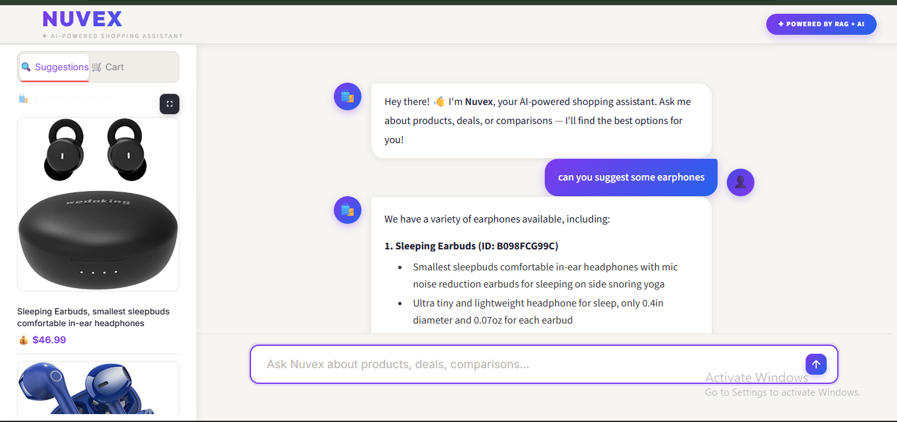
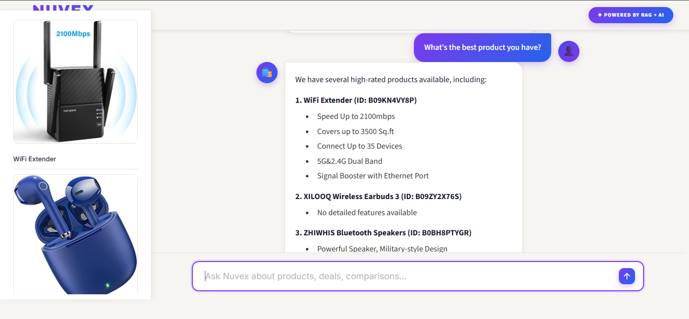
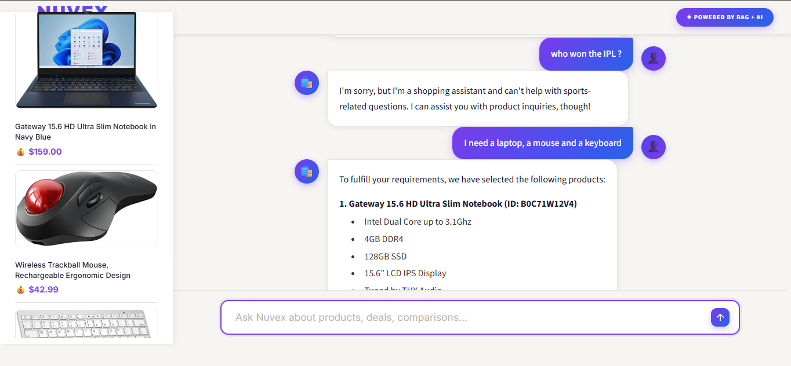

# 🛍️ Nuvex – AI-Powered Shopping Assistant

---

## 📌 Project Description

This project is a **RAG-based AI Shopping Assistant** built for an Amazon product catalogue.

The system uses:

• Retrieval-Augmented Generation (RAG)  
• Qdrant Vector Database  
• LLM via OpenAI / Groq / Google GenAI  
• LangGraph Agent Pipeline 
• Structured Outputs via Instructor + Pydantic
• Prompt Versioning via Jinja2 + LangSmith Registry
• RAGAS Evaluation Framework

to answer user questions about products, features, ratings, and comparisons — through a clean conversational chat interface with a product image sidebar.

---

## 🎯 Objective of the Application

The main objective is to develop a system that:

• Indexes Amazon product data into a Qdrant vector collection  
• Converts product descriptions into semantic embeddings  
• Retrieves relevant products based on user query  
• Generates grounded, accurate answers using an LLM  
• Supports multi-turn conversations with follow-up context
• Evaluates retrieval quality using RAGAS metrics
• Displays results through a clean Streamlit chat UI with product image sidebar

---

## 🛠 Tools and Technologies Used

| Tool | Purpose |
| --- | --- |
| Python 3.12 | Programming Language |
| LangGraph | RAG Agent Pipeline |
| OpenAI / Groq / Google GenAI | LLM for Response Generation |
| Qdrant | Vector Store for Semantic Search |
| Instructor + Pydantic | Structured LLM Outputs |
| FastAPI + httpx | REST API Backend |
| Streamlit | Chat Web Interface |
| LangSmith | Observability & Tracing |
| RAGAS | Retrieval Evaluation |
| Jinja2 + YAML | Prompt Versioning & Management |
| Cohere | Reranking Retrieved Results |
| Docker + Docker Compose | Containerisation |
| uv | Python Package Manager |
| Git & GitHub | Version Control |

---

# 🚀 Project Preview

## ⚙️ Services Running in Docker

All three services — `api`, `qdrant`, and `chat_ui` — running via Docker Compose on the `nuvex-network`.


---

## 💬 Chat Interface – Product Suggestions

Nuvex responding to a product suggestion query with a variety of earphone options.


---

## 🔍 Chat Interface – Filtered Product Search

Nuvex returning the highest-rated product filtered by purchase count and rating threshold.


---

## 🖼️ Sidebar Product Images
 
Product images, descriptions, and prices populate the sidebar automatically after each response.
 

 
---

## 🔀 Query Rewriting and Multi Intent Search

### Intent Router — Off-topic Question Blocked

Nuvex blocking a non-shopping question instantly without hitting the retrieval pipeline.



---

### Multi Intent Search — Laptop, Mouse and Keyboard

Nuvex handling a multi-product query by splitting it into parallel searches and returning all three products with full specifications.



---


# 🗂 Project Structure

```
Nuvex/
├── apps/
│   ├── api/                        # FastAPI backend (uv workspace member)
│   │   ├── Dockerfile
│   │   └── src/
│   │       ├── main.py             # FastAPI entry point
│   │       ├── agents/
│   │       │   └── graph.py        # LangGraph RAG pipeline
│   │       |   ├── retrieval_generation.py  # RAG pipeline (embed, retrieve, generate)
│   │       |   ├── prompts/
│   │       |   │   └── retrieval_generation.yaml  # Versioned prompt template
│   │       └── evals/
│   │           └── eval_retriever.py
│   └── chat_ui/                    # Streamlit frontend (uv workspace member)
│       ├── Dockerfile
│       └── src/
├── notebook/                       # Jupyter notebooks for data ingestion & exploration
├── .env                            # Environment variables (not committed)
├── .gitignore
├── .python-version                 # Python 3.12
├── docker-compose.yml              # Multi-service orchestration
├── Makefile                        # Dev shortcuts
├── pyproject.toml                  # Project dependencies (uv)
└── uv.lock
```

---

## ⚙️ Installation Steps

### Step 1: Clone Repository

```
git clone https://github.com/anusha-sundaramurthi/Nuvex.git
```

---

### Step 2: Go to project folder

```
cd Nuvex
```

---

### Step 3: Create `.env` file

```
OPENAI_API_KEY=your_openai_api_key
GROQ_API_KEY=your_groq_api_key
GOOGLE_API_KEY=your_google_genai_api_key
LANGSMITH_API_KEY=your_langsmith_api_key   # optional
LANGSMITH_TRACING=true                      # optional
CO_API_KEY=your_cohere_api_key             # optional, for reranking notebook
```

---

### Step 4: Ingest product data into Qdrant

Open and run the notebooks in `notebook/` to embed and upload Amazon product data:

```
jupyter notebook notebook/
```

---

## ▶️ How to Run

### Start all services with Make

```
make run-docker-compose
```

This runs `uv sync` and then `docker compose up --build` under the hood.

---

### Or run Docker Compose directly

```
uv sync
docker compose up --build
```

---

### Open the Chat UI

```
http://localhost:8501
```

---

## 🚀 Project Features

✅ Amazon product data indexed into Qdrant vector collection

✅ Semantic search on product embeddings for accurate retrieval

✅ Hybrid search support with BM25 sparse vectors

✅ Cohere reranking for improved result ordering

✅ Multi-turn conversation with follow-up question support

✅ Prompt versioning via Jinja2 YAML templates + LangSmith registry (notebook 10)
 
✅ Grounded answers with numbered product list + bullet point features
 
✅ Product image sidebar — images populate in real-time after each response

✅ Support for multiple LLM providers (OpenAI, Groq, Google GenAI)

✅ Structured outputs via Instructor + Pydantic

✅ Observability and tracing via LangSmith

✅ RAGAS evaluation — Faithfulness, Response Relevancy, Context Precision & Recall

✅ Intent router — off-topic questions blocked before retrieval

✅ Query rewriting — multi-intent queries split into focused parallel searches

✅ Clean Streamlit chat interface

✅ Fully containerised with Docker Compose

---

## 🧠 RAG Pipeline Used

This project uses:

• Retrieval-Augmented Generation (RAG)

• Qdrant Vector Store with Semantic Embeddings

• LangGraph Agent Graph

• Multi-LLM Support (OpenAI / Groq / Google GenAI)

---

## 🔍 How the System Works

```
User Question
     ↓
Streamlit Chat UI (Port 8501)
     ↓
FastAPI Backend (Port 8000)
     ↓
Intent Router (Groq LLM)
(classifies question as shopping-related or off-topic)
     ↓ (off-topic → blocked immediately, no retrieval)
Query Expansion Node (Groq LLM)
(splits multi-intent query into focused sub-queries)
     ↓
Parallel Retrieval via LangGraph Send()
(one Qdrant search per sub-query, all running simultaneously)
     ↓
Gemini Embedding API
(converts each sub-query to 3072-dim vector)
     ↓
Qdrant Vector DB (Port 6333)
(finds top-k relevant products per sub-query)
     ↓
Aggregator Node (Groq LLM)
(combines all retrieved results, generates grounded answer)
     ↓
Structured Output Parser (Pydantic)
(extracts answer text + product IDs)
     ↓
Qdrant Image Lookup
(fetches product image URLs + prices by ID)
     ↓
SSE Stream → Streamlit
(answer rendered as HTML, images shown in sidebar)
```

---

## 📊 Evaluation (RAGAS)
 
The system is evaluated using four RAGAS metrics:
 
| Metric | What It Measures |
| --- | --- |
| **Faithfulness** | Is the answer grounded in the retrieved context? |
| **Response Relevancy** | Is the answer relevant to the user's question? |
| **Context Precision (ID-based)** | Are the right products retrieved? |
| **Context Recall (ID-based)** | Are all relevant products retrieved? |
 
The evaluation dataset is synthetically generated using Gemini and stored in LangSmith (notebook 04), then scored against the live RAG pipeline.
 
---

## 📦 Services Overview

| Service | Port | Description |
| --- | --- | --- |
| `chat_ui` | 8501 | Streamlit conversational frontend |
| `api` | 8000 | FastAPI RAG backend |
| `qdrant` | 6333 / 6334 | Qdrant vector database |

All services communicate over the `nuvex-network` Docker bridge network.

---

## 🔧 Makefile Commands

| Command | Description |
| --- | --- |
| `make run-docker-compose` | Sync dependencies and start all services |
| `make clean-notebook-outputs` | Clear output cells from all notebooks |
| `make run-evals-retriever` | Run RAGAS retriever evaluation |

---

## ⚙️ Tunable Parameters

| Parameter | Default | Effect |
| --- | --- | --- |
| `COLLECTION_NAME` | `Amazon-items-collection-01` | Qdrant collection to query |
| `QDRANT_HOST` | `qdrant` | Qdrant service host |
| `QDRANT_PORT` | `6333` | Qdrant service port |
| `top_k` | `5` | Number of products retrieved per query |
| LLM provider | Groq | Swap for OpenAI or Google GenAI |
| Embedding model | Gemini `gemini-embedding-001` | 3072-dim dense embeddings |

---

## 👩‍💻 Author

Name: Anusha Sundaramurthi

Project: Nuvex – AI-Powered Shopping Assistant (RAG System)

---

## 📌 GitHub Repository

```
https://github.com/anusha-sundaramurthi/Nuvex
```

---

## ⭐ Conclusion

Nuvex demonstrates a production-ready implementation of Retrieval-Augmented Generation using LangGraph, Qdrant, and multi-provider LLM support. It goes beyond a basic RAG system by incorporating hybrid search, structured outputs with grounded references, prompt versioning, RAGAS evaluation, human feedback collection, and a polished Streamlit UI with real-time product image suggestions — all fully containerised with Docker Compose.

The system has been further upgraded with an **intent router** that blocks off-topic questions before any retrieval happens, and **query rewriting with parallel retrieval** using LangGraph's `Send()` API — enabling multi-intent queries like *"a laptop, a mouse and a keyboard"* to be split into focused parallel searches and answered comprehensively in a single response.

---