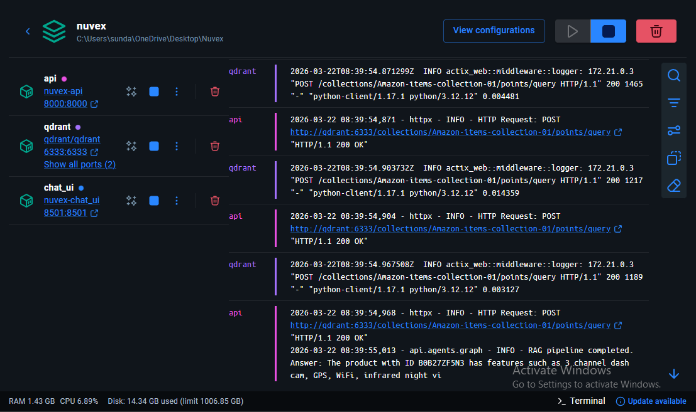
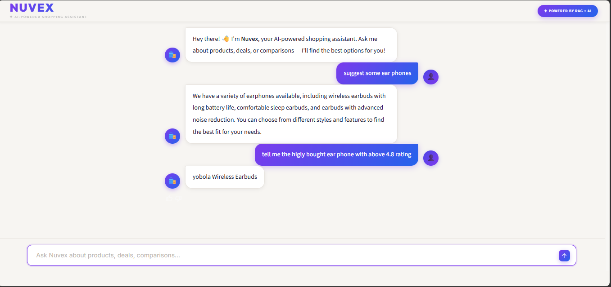
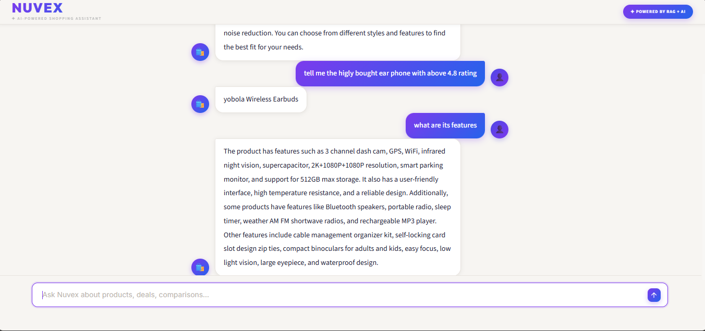

# 🛍️ Nuvex – AI-Powered Shopping Assistant

---

## 📌 Project Description

This project is a **RAG-based AI Shopping Assistant** built for an Amazon product catalogue.

The system uses:

• Retrieval-Augmented Generation (RAG)  
• Qdrant Vector Database  
• LLM via OpenAI / Groq / Google GenAI  
• LangGraph Agent Pipeline  

to answer user questions about products, features, ratings, and comparisons — through a clean conversational chat interface.

---

## 🎯 Objective of the Application

The main objective is to develop a system that:

• Indexes Amazon product data into a Qdrant vector collection  
• Converts product descriptions into semantic embeddings  
• Retrieves relevant products based on user query  
• Generates grounded, accurate answers using an LLM  
• Supports multi-turn conversations with follow-up context  
• Displays results through a clean Streamlit chat UI  

---

## 🛠 Tools and Technologies Used

| Tool | Purpose |
| --- | --- |
| Python 3.12 | Programming Language |
| LangGraph | RAG Agent Pipeline |
| OpenAI / Groq / Google GenAI | LLM for Response Generation |
| Qdrant | Vector Store for Semantic Search |
| Instructor + Pydantic | Structured LLM Outputs |
| FastAPI + httpx | REST API Backend |
| Streamlit | Chat Web Interface |
| LangSmith | Observability & Tracing |
| RAGAS | Retrieval Evaluation |
| Docker + Docker Compose | Containerisation |
| uv | Python Package Manager |
| Git & GitHub | Version Control |

---

# 🚀 Project Preview

## ⚙️ Services Running in Docker

All three services — `api`, `qdrant`, and `chat_ui` — running via Docker Compose on the `nuvex-network`.



---

## 💬 Chat Interface – Product Suggestions

Nuvex responding to a product suggestion query with a variety of earphone options.



---

## 🔍 Chat Interface – Filtered Product Search

Nuvex returning the highest-rated product filtered by purchase count and rating threshold.



---


# 🗂 Project Structure

```
Nuvex/
├── apps/
│   ├── api/                        # FastAPI backend (uv workspace member)
│   │   ├── Dockerfile
│   │   └── src/
│   │       ├── main.py             # FastAPI entry point
│   │       ├── agents/
│   │       │   └── graph.py        # LangGraph RAG pipeline
│   │       └── evals/
│   │           └── eval_retriever.py
│   └── chat_ui/                    # Streamlit frontend (uv workspace member)
│       ├── Dockerfile
│       └── src/
├── notebook/                       # Jupyter notebooks for data ingestion & exploration
├── .env                            # Environment variables (not committed)
├── .gitignore
├── .python-version                 # Python 3.12
├── docker-compose.yml              # Multi-service orchestration
├── Makefile                        # Dev shortcuts
├── pyproject.toml                  # Project dependencies (uv)
└── uv.lock
```

---

## ⚙️ Installation Steps

### Step 1: Clone Repository

```
git clone https://github.com/anusha-sundaramurthi/Nuvex.git
```

---

### Step 2: Go to project folder

```
cd Nuvex
```

---

### Step 3: Create `.env` file

```
OPENAI_API_KEY=your_openai_api_key
GROQ_API_KEY=your_groq_api_key
GOOGLE_API_KEY=your_google_genai_api_key
LANGSMITH_API_KEY=your_langsmith_api_key   # optional
LANGSMITH_TRACING=true                      # optional
```

---

### Step 4: Ingest product data into Qdrant

Open and run the notebooks in `notebook/` to embed and upload Amazon product data:

```
jupyter notebook notebook/
```

---

## ▶️ How to Run

### Start all services with Make

```
make run-docker-compose
```

This runs `uv sync` and then `docker compose up --build` under the hood.

---

### Or run Docker Compose directly

```
uv sync
docker compose up --build
```

---

### Open the Chat UI

```
http://localhost:8501
```

---

## 🚀 Project Features

✅ Amazon product data indexed into Qdrant vector collection

✅ Semantic search on product embeddings for accurate retrieval

✅ Multi-turn conversation with follow-up question support

✅ Grounded answers from LLM using retrieved product context

✅ Support for multiple LLM providers (OpenAI, Groq, Google GenAI)

✅ Structured outputs via Instructor + Pydantic

✅ Observability and tracing via LangSmith

✅ Retriever evaluation using RAGAS

✅ Clean Streamlit chat interface

✅ Fully containerised with Docker Compose

---

## 🧠 RAG Pipeline Used

This project uses:

• Retrieval-Augmented Generation (RAG)

• Qdrant Vector Store with Semantic Embeddings

• LangGraph Agent Graph

• Multi-LLM Support (OpenAI / Groq / Google GenAI)

---

## 🔍 How the System Works

```
User Question
     ↓
Streamlit Chat UI (Port 8501)
     ↓
FastAPI Backend (Port 8000)
     ↓
Qdrant Vector DB (Port 6333)
(finds top-k relevant product chunks)
     ↓
LangGraph RAG Agent
(injects retrieved context into LLM prompt)
     ↓
LLM (OpenAI / Groq / Google GenAI)
(generates grounded product answer)
     ↓
Final Answer displayed in Streamlit UI
```

---

## 📦 Services Overview

| Service | Port | Description |
| --- | --- | --- |
| `chat_ui` | 8501 | Streamlit conversational frontend |
| `api` | 8000 | FastAPI RAG backend |
| `qdrant` | 6333 / 6334 | Qdrant vector database |

All services communicate over the `nuvex-network` Docker bridge network.

---

## 🔧 Makefile Commands

| Command | Description |
| --- | --- |
| `make run-docker-compose` | Sync dependencies and start all services |
| `make clean-notebook-outputs` | Clear output cells from all notebooks |
| `make run-evals-retriever` | Run RAGAS retriever evaluation |

---

## ⚙️ Tunable Parameters

| Parameter | Default | Effect |
| --- | --- | --- |
| `COLLECTION_NAME` | `Amazon-items-collection-01` | Qdrant collection to query |
| `QDRANT_HOST` | `qdrant` | Qdrant service host |
| `QDRANT_PORT` | `6333` | Qdrant service port |
| LLM provider | OpenAI | Swap for Groq or Google GenAI |

---

## 👩‍💻 Author

Name: Anusha Sundaramurthi

Project: Nuvex – AI-Powered Shopping Assistant (RAG System)

---

## 📌 GitHub Repository

```
https://github.com/anusha-sundaramurthi/Nuvex
```

---

## ⭐ Conclusion

This project demonstrates a real-world implementation of Retrieval-Augmented Generation using LangGraph, Qdrant, and multi-provider LLM support — enabling accurate, grounded, and conversational product search for an Amazon product catalogue through a fully containerised, production-ready system.

---
