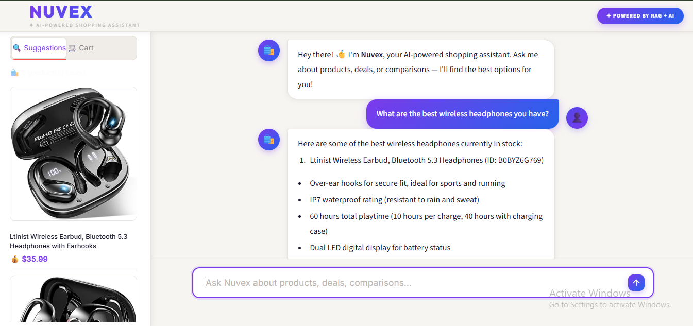
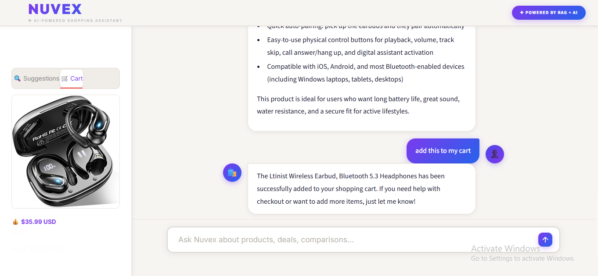
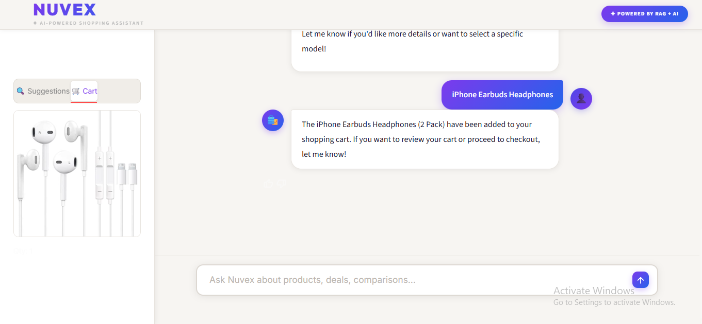

# 🛍️ Nuvex – AI-Powered Shopping Assistant

---

## 📌 Project Description

This project is a **Multi-Agent AI Shopping Assistant** built for an Amazon product catalogue.

The system uses:

• Retrieval-Augmented Generation (RAG)  
• Qdrant Vector Database  
• LLM via OpenAI GPT-4.1  
• LangGraph Multi-Agent Pipeline  
• Structured Outputs via Instructor + Pydantic
• Prompt Versioning via Jinja2 + LangSmith Registry
• RAGAS Evaluation Framework
• Persistent Conversation Memory via PostgresSaver
• Real Shopping Cart and Warehouse Inventory via Postgres

to answer user questions about products, manage shopping carts, check warehouse availability, and reserve stock — through a clean conversational chat interface with a product image sidebar.

---

## 🎯 Objective of the Application

The main objective is to develop a system that:

• Indexes Amazon product data into a Qdrant vector collection  
• Converts product descriptions into semantic embeddings  
• Retrieves relevant products based on user query  
• Generates grounded, accurate answers using an LLM  
• Supports multi-turn conversations with persistent memory across sessions
• Manages a real shopping cart backed by Postgres
• Checks warehouse stock availability and reserves items
• Evaluates retrieval quality using RAGAS metrics
• Displays results through a clean Streamlit chat UI with product image sidebar

---

## 🛠 Tools and Technologies Used

| Tool | Purpose |
| --- | --- |
| Python 3.12 | Programming Language |
| LangGraph | Multi-Agent Pipeline + Checkpointing |
| OpenAI GPT-4.1 | LLM for all agents |
| Qdrant | Vector Store for Semantic + Hybrid Search |
| Instructor + Pydantic | Structured LLM Outputs |
| FastAPI + httpx | REST API Backend |
| Streamlit | Chat Web Interface |
| LangSmith | Observability & Tracing |
| RAGAS | Retrieval Evaluation |
| Jinja2 + YAML | Prompt Versioning & Management |
| Cohere | Reranking Retrieved Results |
| PostgresSaver | Persistent Conversation Memory |
| psycopg2 | Postgres DB Driver |
| FastMCP | MCP Server Protocol |
| Docker + Docker Compose | Containerisation |
| uv | Python Package Manager |
| Git & GitHub | Version Control |

---

# 🚀 Project Preview

## ⚙️ Services Running in Docker

All services — `api`, `qdrant`, `postgres`, `chat_ui`, `items_mcp_server`, `reviews_mcp_server` — running via Docker Compose on the `nuvex-network`.


---

## 💬 Chat Interface – Product Suggestions

Nuvex responding to a product suggestion query with a variety of earphone options.


---

## 🔍 Chat Interface – Filtered Product Search

Nuvex returning the highest-rated product filtered by purchase count and rating threshold.


---

## 🖼️ Sidebar Product Images
 
Product images, descriptions, and prices populate the sidebar automatically after each response.
 

 
---

## 🔀 Query Rewriting and Multi Intent Search

### Intent Router — Off-topic Question Blocked

Nuvex blocking a non-shopping question instantly without hitting the retrieval pipeline.


---

### Multi Intent Search — Laptop, Mouse and Keyboard

Nuvex handling a multi-product query by splitting it into parallel searches and returning all three products with full specifications.


---

## 🤖 Multi-Agent Architecture

### Product QA Agent — Wireless Headphones Search

The Product QA Agent searches the product catalogue and returns detailed specifications with product images in the sidebar. Each product is listed with bullet-point features pulled directly from the vector database.



---

### Multi-Turn Memory — Add to Cart

The user says *"add this to my cart"* without specifying which product. The system remembers the previous turn via `PostgresSaver` and correctly identifies and adds the Ltinist Wireless Earbuds to the shopping cart.



---

### Shopping Cart Agent — Item Added

The Shopping Cart Agent confirms the iPhone Earbuds have been added to the cart with the product image appearing in the sidebar.



---

# 🗂 Project Structure

```
Nuvex/
├── apps/
│   ├── api/                        # FastAPI backend (uv workspace member)
│   │   ├── Dockerfile
│   │   └── src/
│   │       └── api/
│   │           ├── agents/
│   │           │   ├── agents.py           # 4 agent functions
│   │           │   ├── tools.py            # All tool functions
│   │           │   ├── graph.py            # Multi-agent LangGraph pipeline
│   │           │   ├── retrieval_generation.py
│   │           │   ├── prompts/            # YAML prompt templates
│   │           │   └── utils/
│   │           └── core/
│   │               └── config.py
│   ├── chat_ui/                    # Streamlit frontend (uv workspace member)
│   │   ├── Dockerfile
│   │   └── src/
│   ├── items_mcp_server/           # MCP server for product search
│   │   ├── Dockerfile
│   │   └── src/
│   └── reviews_mcp_server/         # MCP server for reviews search
│       ├── Dockerfile
│       └── src/
├── notebook/                       # Jupyter notebooks (weeks 1–5)
├── scripts/
│   └── sql/                        # Postgres init scripts
│       ├── shopping_cart_table.sql
│       └── warehouse_management.sql
├── .env                            # Environment variables (not committed)
├── docker-compose.yml              # Multi-service orchestration
├── pyproject.toml                  # Workspace dependencies (uv)
└── uv.lock
```

---

## ⚙️ Installation Steps

### Step 1: Clone Repository

```
git clone https://github.com/anusha-sundaramurthi/Nuvex.git
```

---

### Step 2: Go to project folder

```
cd Nuvex
```

---

### Step 3: Create `.env` file

```
OPENAI_API_KEY=your_openai_api_key
GROQ_API_KEY=your_groq_api_key
GOOGLE_API_KEY=your_google_genai_api_key
LANGSMITH_API_KEY=your_langsmith_api_key   # optional
LANGSMITH_TRACING=true                      # optional
CO_API_KEY=your_cohere_api_key             # optional, for reranking notebook
```

---

### Step 4: Ingest product data into Qdrant

Open and run the notebooks in `notebook/` to embed and upload Amazon product data:

```
jupyter notebook notebook/
```

---

## ▶️ How to Run

### Start all services with Make

```
make run-docker-compose
```

This runs `uv sync` and then `docker compose up --build` under the hood.

---

### Or run Docker Compose directly

```
uv sync
docker compose up --build
```

---

### Open the Chat UI

```
http://localhost:8501
```

---

## 🚀 Project Features

✅ Amazon product data indexed into Qdrant vector collection

✅ Semantic search on product embeddings for accurate retrieval

✅ Hybrid search support with BM25 sparse vectors

✅ Cohere reranking for improved result ordering

✅ Multi-turn conversation with persistent memory via PostgresSaver

✅ Prompt versioning via Jinja2 YAML templates + LangSmith registry

✅ Grounded answers with numbered product list + bullet point features

✅ Product image sidebar — images populate in real-time after each response

✅ Structured outputs via Instructor + Pydantic

✅ Observability and tracing via LangSmith

✅ RAGAS evaluation — Faithfulness, Response Relevancy, Context Precision & Recall

✅ Intent router — off-topic questions blocked before retrieval

✅ Query rewriting — multi-intent queries split into focused parallel searches

✅ Coordinator agent — routes requests to the right specialist agent

✅ Product QA agent — searches products and reviews with tool use

✅ Shopping cart agent — add, view, remove items backed by Postgres

✅ Warehouse manager agent — check stock and reserve items across warehouses

✅ MCP servers — items and reviews served as independent Docker HTTP services

✅ Real-time streaming status — UI updates as each agent node runs

✅ Fully containerised with Docker Compose (6 services)

---

## 🧠 Multi-Agent Architecture

The system uses a coordinator-specialist pattern with four agents:

```
User Message
     ↓
Coordinator Agent (GPT-4.1)
(reads intent, creates delegation plan, routes to specialist)
     ↓
┌────────────────┬─────────────────────┬──────────────────────────┐
│                │                     │                          │
Product QA    Shopping Cart       Warehouse Manager
Agent         Agent               Agent
│                │                     │
├── get_items  ├── add_to_cart     ├── check_availability
└── get_reviews└── get_cart        └── reserve_items
               └── remove_from_cart
     ↓
Coordinator Agent
(synthesises final answer)
     ↓
Streamlit UI
```

---

## 🔍 How the System Works

```
User Question
     ↓
Streamlit Chat UI (Port 8501)
     ↓
FastAPI Backend (Port 8000)
     ↓
Coordinator Agent (GPT-4.1)
(reads intent, creates plan, delegates to specialist agent)
     ↓
Product QA / Shopping Cart / Warehouse Manager Agent
(each has own tools, iterates until final_answer=True)
     ↓
Tool Node (ToolNode)
(executes tool calls — Qdrant search, Postgres read/write)
     ↓
PostgresSaver (langgraph_db)
(checkpoints full conversation state for multi-turn memory)
     ↓
Coordinator Agent
(receives specialist result, generates final answer)
     ↓
Qdrant Image Lookup
(fetches product image URLs + prices by product ID)
     ↓
Postgres Cart Lookup
(fetches current shopping cart items)
     ↓
SSE Stream → Streamlit
(answer + product images in sidebar + cart tab updated)
```

---

## 📊 Evaluation (RAGAS)
 
The system is evaluated using four RAGAS metrics:
 
| Metric | What It Measures |
| --- | --- |
| **Faithfulness** | Is the answer grounded in the retrieved context? |
| **Response Relevancy** | Is the answer relevant to the user's question? |
| **Context Precision (ID-based)** | Are the right products retrieved? |
| **Context Recall (ID-based)** | Are all relevant products retrieved? |
 
The evaluation dataset is synthetically generated using Gemini and stored in LangSmith (notebook 04), then scored against the live RAG pipeline.
 
---

## 📦 Services Overview

| Service | Port | Description |
| --- | --- | --- |
| `chat_ui` | 8501 | Streamlit conversational frontend |
| `api` | 8000 | FastAPI multi-agent backend |
| `qdrant` | 6333 / 6334 | Qdrant vector database |
| `postgres` | 5433 | Postgres — conversation memory + cart + warehouse |
| `items_mcp_server` | 8001 | MCP server for product search |
| `reviews_mcp_server` | 8002 | MCP server for reviews search |

All services communicate over the `nuvex-network` Docker bridge network.

---

## 🔧 Makefile Commands

| Command | Description |
| --- | --- |
| `make run-docker-compose` | Sync dependencies and start all services |
| `make clean-notebook-outputs` | Clear output cells from all notebooks |
| `make run-evals-retriever` | Run RAGAS retriever evaluation |

---

## ⚙️ Tunable Parameters

| Parameter | Default | Effect |
| --- | --- | --- |
| `COLLECTION_NAME` | `Amazon-items-collection-01-hybrid-search` | Qdrant collection to query |
| `QDRANT_HOST` | `qdrant` | Qdrant service host |
| `QDRANT_PORT` | `6333` | Qdrant service port |
| `top_k` | `5` | Number of products retrieved per query |
| LLM | GPT-4.1 | Main agent LLM |
| Embedding model | `text-embedding-3-large` | 3072-dim dense embeddings |

---

## 👩‍💻 Author

Name: Anusha Sundaramurthi

Project: Nuvex – AI-Powered Shopping Assistant

---

## 📌 GitHub Repository

```
https://github.com/anusha-sundaramurthi/Nuvex
```

---

## ⭐ Conclusion

Nuvex demonstrates a production-ready implementation of a multi-agent AI shopping assistant using LangGraph, Qdrant, and OpenAI GPT-4.1. It goes beyond a basic RAG system by incorporating a full coordinator-specialist agent architecture, real Postgres-backed shopping cart and warehouse inventory, persistent multi-turn conversation memory via PostgresSaver, hybrid search with BM25 sparse vectors, structured outputs with grounded references, prompt versioning, RAGAS evaluation, human feedback collection, MCP servers as independent Docker services, and a polished Streamlit UI with real-time product image suggestions and cart management — all fully containerised with Docker Compose across 6 services.